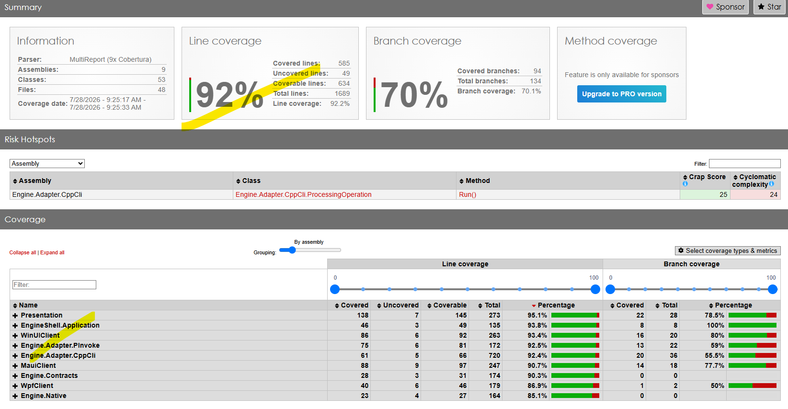

# EngineShell.Platform

EngineShell.Platform is an evolving .NET 9 architecture POC that demonstrates
how WPF, WinUI 3, and .NET MAUI clients can share presentation logic,
application services, processing contracts, and UI automation while keeping
framework-specific code isolated.

Processing implementations are hidden behind `IProcessingEngine`. A client
selects an adapter at its composition root, while the rest of the application
remains unaware of whether processing is performed by native C++, C++/CLI,
P/Invoke, or a managed simulator. This applies dependency inversion: policies
depend on the stable engine contract, and the executable chooses the concrete
implementation only when the application is composed.

> This repository is under active development. It demonstrates architectural
> patterns and test infrastructure; it is not intended to be a
> production-ready framework.

## What this POC demonstrates

- Shared MVVM presentation logic across WPF, WinUI 3, and .NET MAUI
- Thin, platform-specific XAML views and application composition roots
- Replaceable processing engines behind `IProcessingEngine`
- Native C++ integration through both P/Invoke and C++/CLI adapters
- Request/result mapping and native-to-managed progress callbacks
- Reactive engine events, progress reporting, and cancellation
- A WPF AI chat workflow using local Ollama structured output and allowlisted
  application tools
- Unit, integration, headless, and desktop UI test layers
- Shared FlaUI/UIA3 page objects for WPF, WinUI 3, and MAUI on Windows
- A logical automation contract that tolerates framework-specific UIA trees
- Managed and native code coverage across unit, integration, and UI workflows

## Architecture

Application workflows depend on stable contracts rather than concrete UI
frameworks or engine technologies. WPF, WinUI 3, and .NET MAUI reuse a shared
MVVM Presentation layer. Non-MVVM hosts can reuse Application and
Engine.Contracts while providing their own interaction layer.

Concrete engine adapters implement `IProcessingEngine` and depend inward on
`Engine.Contracts`. Each executable selects its adapter at the composition
root, allowing the implementation to be replaced without changing shared
application or presentation workflows.

For dependency diagrams, composition-root rationale, presentation boundaries,
headless intent, and design guidelines, see
[Architecture](docs/architecture.md).

For the engine contract, native C ABI, callbacks, threading, cancellation, and
deployment details, see
[Processing and native integration](docs/processing-and-native-integration.md).

## AI-assisted processing (WPF POC)

The WPF client includes a deliberately small vertical slice that lets a user
request file processing in natural language. Ollama and the selected model run
locally; the POC does not use a cloud AI API or require an API key.

```text
ChatView
  → ChatViewModel
  → ChatService
  → local Ollama structured plan
  → allowlisted tool dispatch
  → ProcessingService
  → IProcessingEngine
  → Engine.Native
```

The AI proposes a structured action but cannot invoke application services
directly. The application validates the allowlisted `process_file` tool,
executes the existing processing pipeline, displays native progress, and
reports a verified result. The view also includes editable prompt suggestions,
deterministic capability help, and cancellation.

Only WPF opts into the view for now, but the orchestration and processing
workflow remain outside WPF-specific code.

For architecture, local setup, configuration, troubleshooting, tests, and
current limitations, see
[AI-assisted processing](docs/ai-assisted-processing.md).

## Solution layout

```text
src/
├── Application/
├── Domain/
├── Engine.Contracts/
├── Engine.Native/
├── Presentation/
├── AI.Adapters/
│   └── AI.Adapter.Ollama/
├── Engine.Adapters/
│   ├── Engine.Adapter.PInvoke/
│   ├── Engine.Adapter.CppCli/
│   ├── Engine.Adapter.Grpc/
│   └── Engine.Adapter.Simulator/
└── Clients/
    ├── WpfClient/
    ├── WinUIClient/
    ├── MauiClient/
    └── HeadlessClient/

tests/
├── Unit/
│   ├── Application.Tests/
│   └── Presentation.Tests/
├── Integration/
│   ├── Workflow.Tests/
│   ├── PInvoke.Adapter.Tests/
│   └── CppCli.Adapter.Tests/
├── Headless/
└── UI/
    ├── UiTest.Infrastructure/
    ├── Wpf.UiTests/
    ├── WinUI.UiTests/
    └── Maui.UiTests/
```

The solution entry point is [`ClientAgnostic.sln`](ClientAgnostic.sln).

## Client implementations

### WPF and WinUI 3

Both Windows clients implement the same shared shell workflow and view-model
navigation. Each client owns its XAML, resources, dialogs, theme integration,
and startup composition. Their automation IDs and logical UI behavior remain
aligned so the same UI test infrastructure can exercise both frameworks.

The WinUI client is an unpackaged, self-contained `win-x64` application and
uses application-level data templates, accent button styles, and persistent
Light/Dark theme selection.

### .NET MAUI

The MAUI client reuses the same shell, navigation, feature, and processing view
models. Its platform layer contains small `ContentView` implementations, a
shared-view-model-to-MAUI-view host, theme integration, and its composition
root. Windows UI automation follows the same logical page-object contract as
WPF and WinUI.

### Headless

`HeadlessClient` is a presentation-free executable scaffold whose application
workflow is not implemented yet. `Headless.Tests` separately verifies shared
MVVM workflows without creating desktop controls. See
[Headless boundaries](docs/architecture.md#headless-boundaries).

## Current status

| Area | Status |
| --- | --- |
| Engine contracts | Requests, results, progress, cancellation, and reactive engine events implemented |
| Native engine | C-compatible request DTO and progress/completion callback API implemented |
| P/Invoke adapter | Calls `Engine.Native` and maps native callbacks to managed progress and results |
| C++/CLI adapter | Calls `Engine.Native` through a managed C++/CLI bridge |
| Simulator adapter | Cross-platform managed processing workflow implemented |
| gRPC adapter | Architectural scaffold; transport workflow is not implemented |
| WPF client | Shared shell, navigation, views, themes, processing, and experimental Ollama chat workflow implemented |
| WinUI client | Shared shell, navigation, views, themes, and processing workflow implemented |
| MAUI client | Shared shell, navigation, views, themes, and processing workflow implemented |
| Headless client | Presentation-free executable scaffold; application workflow is not implemented yet |
| Tests | Unit, workflow, native-adapter, headless, and three desktop UI suites implemented |

## Prerequisites

- Windows 10 version 1809 or newer
- .NET 9 SDK
- Visual Studio 2022 with:
  - .NET desktop development
  - Windows application development
  - .NET Multi-platform App UI development
  - Desktop development with C++

The C++/CLI and native projects target x64. Use an x64 solution configuration
when building the complete solution or running native adapter tests.

## Build

Managed clients can be built independently with the .NET CLI:

```powershell
dotnet build src/Clients/WpfClient/WpfClient.csproj
dotnet build src/Clients/WinUIClient/WinUIClient.csproj
dotnet build src/Clients/MauiClient/MauiClient.csproj -f net9.0-windows10.0.19041.0
dotnet build src/Clients/HeadlessClient/HeadlessClient.csproj
```

Because the complete solution contains native C++ and C++/CLI projects, build
it with Visual Studio or Visual Studio MSBuild:

```powershell
msbuild ClientAgnostic.sln /restore /t:Build /p:Configuration=Debug /p:Platform=x64
```

## Testing

The solution uses a layered test strategy:

| Test layer | Purpose |
| --- | --- |
| **Unit** | Application and Presentation behavior in isolation |
| **Workflow** | Dependency registration and multi-component workflows |
| **Adapter integration** | Real P/Invoke and C++/CLI calls into `Engine.Native` |
| **Headless** | Shared MVVM workflows without graphical controls |
| **UI** | Critical WPF, WinUI 3, and MAUI journeys through FlaUI/UIA3 |

Run the managed, non-interactive suites:

```powershell
dotnet test tests/Unit/Application.Tests/Application.Tests.csproj
dotnet test tests/Unit/Presentation.Tests/Presentation.Tests.csproj
dotnet test tests/Integration/Workflow.Tests/Integration.Tests.csproj
dotnet test tests/Headless/Headless.Tests.csproj
```

Build the x64 solution before running the native adapter suites:

```powershell
dotnet test tests/Integration/PInvoke.Adapter.Tests/PInvoke.Adapter.Tests.csproj --no-build -p:Platform=x64
dotnet test tests/Integration/CppCli.Adapter.Tests/CppCli.Adapter.Tests.csproj --no-build -p:Platform=x64
```

### Desktop UI automation

UI tests require an unlocked, interactive Windows desktop:

```powershell
dotnet test tests/UI/Wpf.UiTests/Wpf.UiTests.csproj
dotnet test tests/UI/WinUI.UiTests/WinUI.UiTests.csproj
dotnet test tests/UI/Maui.UiTests/Maui.UiTests.csproj
```

`UiTest.Infrastructure` provides:

- A common application fixture contract and lifecycle
- Shared automation IDs and logical contract verification
- Shared shell, component, and page objects
- Explicit waits and failure screenshots
- A desktop mutex to prevent concurrent UI manipulation

The client test projects contain only their executable launcher and
framework-specific test cases. Current journeys cover startup, automation
contract verification, header navigation, processing with terminal status and
full progress, and theme switching where supported.

If MAUI executable discovery differs on your machine, set `MAUI_CLIENT_EXE` to
the built `MauiClient.exe` path.

## Code coverage

The coverage workflow spans the managed application, both native adapter
boundaries, the C++ engine, and all three desktop clients. It builds the x64
solution, runs every test project, validates the generated results, and
produces merged HTML and Cobertura reports:

```powershell
.\scripts\coverage.ps1
```

Use `-SkipBuild` when the complete `Debug | x64` solution is already built:

```powershell
.\scripts\coverage.ps1 -SkipBuild
```

Use `-SkipUi` when no unlocked interactive desktop is available:

```powershell
.\scripts\coverage.ps1 -SkipUi
```

### What is measured

| Coverage path | Collector | Code measured |
| --- | --- | --- |
| Unit, workflow, and headless tests | Coverlet | Contracts, Application, and Presentation |
| Adapter integration tests | Microsoft Code Coverage | P/Invoke, C++/CLI, and `Engine.Native` |
| Desktop UI tests | `dotnet-coverage` | WPF, WinUI, MAUI, and the shared managed layers loaded by each client |

Native coverage uses the Debug x64 PDB and Microsoft native instrumentation.
The Debug `Engine.Native` build enables the linker support required for static
instrumentation; Release binaries are not modified for coverage.

The native adapter suites intentionally exercise the same engine through two
boundaries:

```text
PInvoke.Adapter.Tests ──► P/Invoke adapter ──┐
                                             ├──► Engine.Native
CppCli.Adapter.Tests  ──► C++/CLI adapter ───┘
```

ReportGenerator merges matching source lines rather than counting the native
engine twice.

### Reports

Each invocation writes to a timestamped directory so an open report or Visual
Studio Test Explorer cannot lock the next run:

```text
.coverage/runs/<timestamp>/
├── raw/
├── non-ui-report/
├── ui-report/
└── overall-report/
```

| Report | Contents |
| --- | --- |
| `non-ui-report/index.html` | Unit, workflow, headless, P/Invoke, C++/CLI, and native C++ coverage |
| `ui-report/index.html` | Coverage observed through the WPF, WinUI, and MAUI client processes |
| `overall-report/index.html` | Deduplicated union of every non-UI and UI coverage result |

The script performs sanity checks before reporting success:

- Every `IsTestProject=true` project must be registered in the workflow.
- Every suite must discover at least one test and report zero failures.
- Every expected coverage file must exist and contain coverable lines.
- Covered-line totals must be internally consistent.

### Reference snapshot

A full local run captured on July 28, 2026 completed all 50 tests that existed
at that point and produced:

| Metric | Result |
| --- | ---: |
| Line coverage | **92.2%** — 585 / 634 |
| Branch coverage | **70.1%** — 94 / 134 |
| Method coverage | **90.4%** — 142 / 157 |
| `Engine.Native` line coverage | **85.1%** |
| C++/CLI adapter line coverage | **92.4%** |
| P/Invoke adapter line coverage | **92.5%** |



Coverage percentages are a diagnostic snapshot rather than a release gate.
This snapshot predates the AI-assisted processing tests; run the coverage
script for current totals.
Native branch information is less granular than managed branch coverage, so
native line coverage and the adapter integration tests are the primary signals
for this POC.

## Dependency management

Shared compiler settings are defined in
[`Directory.Build.props`](Directory.Build.props). NuGet versions are managed
centrally in [`Directory.Packages.props`](Directory.Packages.props), so project
files normally contain versionless `PackageReference` entries.

Notable dependencies include:

- CommunityToolkit.Mvvm
- Microsoft.Extensions.DependencyInjection
- Microsoft.WindowsAppSDK
- System.Reactive
- MSTest and Moq
- FlaUI.Core and FlaUI.UIA3

## Roadmap

- Implement the gRPC adapter workflow
- Implement the presentation-free HeadlessClient workflow
- Extend native processing beyond the current demonstration operation
- Add CI build and test pipelines
- Add packaging and release automation

## Notes

Built with assistance from AI coding tools for scaffolding and documentation;
architecture and design decisions are my own.
